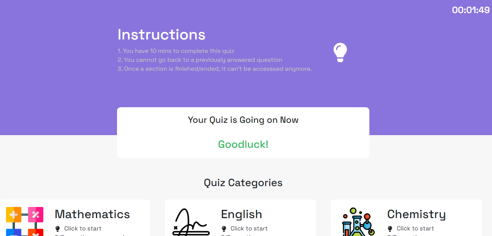

# Techie Quiz App

### About the maintainer
I am Uchechukwu Nwankwo and I'm a Full Stack developer. I work with ReactJS for building frontend applications as well as Node.js for building backends. My go-to database management system is MongoDB, nevertheless I am also proficient using PostgreSQL.

- [**LinkedIn**](https://linkedin.com/in/uchechukwu10)
- [**Twitter**](https://twitter.com/Maazi_Of_042)
- [**Portfolio**](https://github.com/Uchechukwu10/Personal-Portfolio)

### About the Project
This is a quiz app currently in development phase. The end goal is to create a solution for students to practice Computer based examinations at the comfort of their homes. The questions for this app are currently local. The quiz app is classified into various categories. At the end of the quiz, your final score is displayed.

### Implemented Features
- Categorization of quiz
- Quiz timer
- Proper styling using tailwind css
- Responsiveness across all screens

### Yet to be implemented features
- Fetch questions from API
- Restructure code to follow proper guidelines

## Contributing
1. Create an issue clearly describing the change you want to implement
2. Fork this repository
3. Clone your forked repository into your local machine in your desired folder
4. cd into the project folder
5. Run `npm install`
6. Access the code base and make desired changes
7. Commit and push your changes to your forked repository
8. Make a pull request to merge into the original repository
9. Your pull request will be checked and merged if it passes

### Stacks
`ReactJS` 
